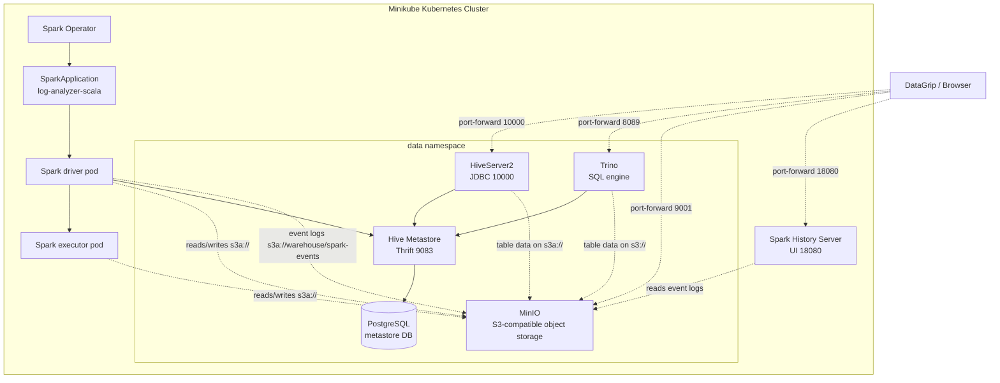

# Kubernetes data platform with Spark, MinIO, Hive, and Trino

This repository is being migrated to a Minikube-based data platform using Spark Operator for Spark jobs, MinIO for object storage, Hive Metastore and HiveServer2 for metadata/JDBC access, and Trino for interactive SQL.

The Kubernetes target is MinIO-first. It does not deploy Hadoop, HDFS, or YARN.

## Kubernetes Cluster Setup

The current Kubernetes target is Minikube with Spark Operator, MinIO, Hive Metastore, HiveServer2, Trino, and the Scala log analyzer job. Storage is MinIO-first; HDFS and YARN are not deployed in Kubernetes.

Install local tooling:

```bash
brew install minikube kubectl helm
```

Start Minikube:

```bash
minikube start \
  --cpus=4 \
  --memory=11264 \
  --disk-size=60g \
  --driver=docker
```

Create namespaces and the Spark service account:

```bash
kubectl apply -f ./k8s/platform/namespaces.yaml
```

Install Spark Operator:

```bash
helm repo add spark-operator https://kubeflow.github.io/spark-operator
helm repo update

helm upgrade --install spark-operator spark-operator/spark-operator \
  --namespace spark \
  --version 2.5.1 \
  --set 'spark.jobNamespaces={spark}' \
  --set webhook.enable=true
```

Deploy the data and query services:

```bash
kubectl apply -f ./k8s/platform/minio.yaml
kubectl apply -f ./k8s/platform/hive.yaml
kubectl apply -f ./k8s/platform/trino.yaml
kubectl apply -f ./k8s/platform/spark-history.yaml

kubectl get pods -n data --watch
```

Upload input data through the MinIO Console:

```bash
kubectl port-forward -n data svc/minio 9001:9001
```

Open `http://localhost:9001`, sign in with `minioadmin` / `minioadmin`, create the `logs` bucket if needed, and upload `jobs/log-analyzer-scala/log-generator/web_server_logs.txt` as `web_server_logs.txt`. The Spark job reads it from `s3a://logs/web_server_logs.txt`.

Build and load the Scala job image into Minikube:

```bash
docker build --platform linux/arm64 -t log-analyzer-scala ./jobs/log-analyzer-scala
minikube image load log-analyzer-scala
```

Run the job through Spark Operator:

```bash
kubectl apply -f ./k8s/log-analyzer-scala.yaml
kubectl get sparkapplication -n spark --watch
kubectl logs -n spark log-analyzer-scala-driver
```

Local connections:

```bash
kubectl port-forward deployment/hive-server --address localhost 10000:10000 -n data
kubectl port-forward -n data svc/trino 8089:8080
kubectl port-forward -n spark svc/spark-history-server 18080:18080
```

- Hive JDBC: `jdbc:hive2://localhost:10000/default;auth=noSasl`
- Trino JDBC: `jdbc:trino://localhost:8089/hive/default`
- MinIO Console: `http://localhost:9001`
- Spark History Server: `http://localhost:18080`

For the detailed migration notes and remaining work, see `roadmap/migrate_to_k8s.md`.

## Architecture Overview

The current Kubernetes architecture is:




## Legacy Docker Compose Reference

The Docker Compose stack in this repository is the older Hadoop/HDFS/YARN-based local environment. The active Kubernetes migration does not use Hadoop services.

### Quick Start

To deploy the HDFS-Spark-Hive cluster, run:
```
  docker-compose up
```

Hive metastore data is stored in the `hive_metastore_postgresql` named volume, and HDFS data is stored in the Hadoop named volumes. Use `docker-compose down` to stop containers while keeping Hive table metadata and warehouse files. Avoid `docker-compose down -v` unless you intentionally want to delete those volumes.

`docker-compose` creates a docker network that can be found by running `docker network list`, e.g. `wexler-data-platform_default`.

Web UIs (how to access)

The Hadoop/Spark services expose several helpful web interfaces. If running Docker on your laptop (Docker Desktop), most interfaces are available via localhost. If using a remote Docker host, substitute <dockerhadoop_IP_address> with the host IP found via `docker network inspect`.

Common URLs (localhost or <dockerhadoop_IP_address>):

Below is the current accessibility status for each UI (why a URL like http://localhost:8188/applicationhistory may not work): many services run inside containers and are not published to the host by default. If a port is not mapped in docker-compose.yml you cannot reach it via localhost.

Published to host (accessible via localhost):

* Namenode (HDFS web UI / Explorer): http://localhost:9870/explorer.html#/  — mapped in docker-compose (9870:9870)
* DataNode: http://localhost:9864/  — mapped (9864:9864)
* Spark Master (cluster UI): http://localhost:8080/  — mapped (8080:8080)
* Spark worker: http://localhost:8081/  — mapped (8081:8081)
* Spark Application UI (per-app, default port on driver): http://localhost:4040/ for client-mode drivers on spark-master, or http://localhost:4041/ for cluster-mode drivers on spark-worker-1. Only visible while an application runs.
* HiveServer2 (JDBC): port 10000 is published (JDBC, not a web UI): connect with `jdbc:hive2://localhost:10000`
* Hive metastore service: http://localhost:9083/ (thrift) — mapped (9083:9083) but not a browser dashboard
* Trino coordinator UI: http://localhost:8089/  — mapped (host 8089 -> container 8080)

Not published to host by default (internal-only — reachable from other containers):

* ResourceManager (YARN): internal port 8088 — not published in docker-compose. Example why http://localhost:8088/ fails. Options: publish 8088:8088 in docker-compose, curl the service from a container (`docker exec -it namenode curl http://resourcemanager:8088/`), or use the container IP.
* NodeManager (node details): internal port 8042 — not published by default. See same access options as ResourceManager.
* MapReduce / History Server (job history): internal port 8188 — not published, so http://localhost:8188/applicationhistory will fail unless port is published.
* Spark History Server: not configured/published in this compose file (so http://localhost:18080 will not be available).

Other reasons a UI may be unreachable:

* Service not yet started or failed to start — check container logs (`docker logs <container>`).
* The UI is per-application and only exists while a job runs (e.g., Spark driver UI at 4040 shows only during app lifetime).
* Docker Desktop networking (on macOS/Windows) sometimes routes differently — use published host ports or exec into a container to curl internals.

If you want, the compose file can be updated to publish additional ports (e.g., 8088, 8042, 8188) so all UIs work via localhost. Otherwise use the container network or inspect container IPs to access internal dashboards.

These notes should clarify why some URLs (like http://localhost:8188/applicationhistory) are not accessible by default and what to do about it.

## Quick Start HDFS

Open a shell on the namenode:
```bash
  docker exec -it namenode bash
```

Create a directory and upload a file:
```bash
  hdfs dfs -mkdir -p /data/example
  echo "hello world" > sample.txt
  hdfs dfs -put sample.txt /data/example/
  hdfs dfs -cat /data/example/sample.txt
```


## Interactive Querying with Spark Shells

Spark provides interactive REPL shells for ad-hoc data exploration. You can use either the Scala shell (`spark-shell`) or the Python shell (`pyspark`).

Exec into the `spark-master` container and launch a shell:
```bash
  docker exec -it spark-master bash

  # Scala
  /spark/bin/spark-shell --master spark://spark-master:7077

  # or Python
  /spark/bin/pyspark --master spark://spark-master:7077
```

Run a quick test to verify the cluster is working:
```scala
  val df = spark.range(1000).toDF("id")
  df.show(5)
```


## Quick Start Hive

Connect to the Hive server using Beeline:
```bash
  docker exec -it hive-server bash

  beeline -u jdbc:hive2://localhost:10000 -n root
```

Verify Hive is working:
```sql
  show databases;

  create database IF NOT EXISTS test_db;
  use test_db;

  CREATE TABLE IF NOT EXISTS sample (id INT, name STRING);
  INSERT INTO sample VALUES (1, 'hello'), (2, 'world');
  SELECT * FROM sample;
```

There you go: your private Hive server to play with.


## Configure Environment Variables

The configuration parameters can be specified in the hadoop.env file or as environmental variables for specific services (e.g. namenode, datanode etc.):
```
  CORE_CONF_fs_defaultFS=hdfs://namenode:8020
```

CORE_CONF corresponds to core-site.xml. fs_defaultFS=hdfs://namenode:8020 will be transformed into:
```
  <property><name>fs.defaultFS</name><value>hdfs://namenode:8020</value></property>
```
To define dash inside a configuration parameter, use triple underscore, such as YARN_CONF_yarn_log___aggregation___enable=true (yarn-site.xml):
```
  <property><name>yarn.log-aggregation-enable</name><value>true</value></property>
```

The available configurations are:
* /etc/hadoop/core-site.xml CORE_CONF
* /etc/hadoop/hdfs-site.xml HDFS_CONF
* /etc/hadoop/yarn-site.xml YARN_CONF
* /etc/hadoop/httpfs-site.xml HTTPFS_CONF
* /etc/hadoop/kms-site.xml KMS_CONF
* /etc/hadoop/mapred-site.xml  MAPRED_CONF

If you need to extend some other configuration file, refer to base/entrypoint.sh bash script.
