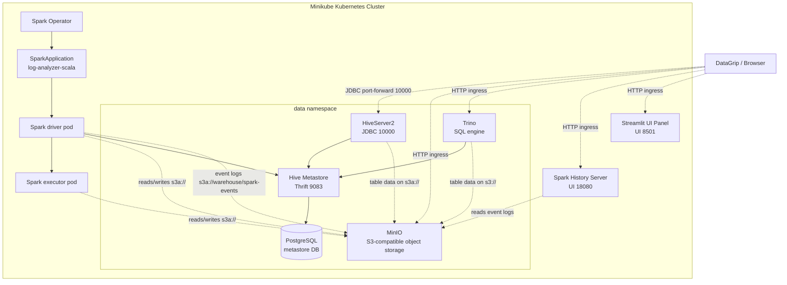

# Kubernetes data platform with Spark, MinIO, Hive, and Trino

This repository is being migrated to a Minikube-based data platform using Spark Operator for Spark jobs, MinIO for object storage, Hive Metastore and HiveServer2 for metadata/JDBC access, and Trino for interactive SQL.

The Kubernetes target is MinIO-first. It does not deploy Hadoop, HDFS, or YARN.

## Kubernetes Cluster Setup

The current Kubernetes target is Minikube with Spark Operator, MinIO, Hive Metastore, HiveServer2, Trino, and the Scala log analyzer job. Storage is MinIO-first; HDFS and YARN are not deployed in Kubernetes.

Install local tooling:

```bash
brew install minikube kubectl helm
```

Start Minikube:

```bash
minikube start \
  --cpus=4 \
  --memory=11264 \
  --disk-size=60g \
  --driver=docker
```

> [!TIP]
> If you restart Minikube or encounter TLS/certificate/connection errors (e.g., `tls: failed to verify certificate`), run the following command to update your local `kubectl` context:
> ```bash
> minikube update-context
> ```

Enable the local ingress controller:

```bash
minikube addons enable ingress
```

Create namespaces and the Spark service account:

```bash
kubectl apply -f ./k8s/platform/namespaces.yaml
```

Install Spark Operator:

```bash
helm repo add spark-operator https://kubeflow.github.io/spark-operator
helm repo add strimzi https://strimzi.io/charts/
helm repo update

helm upgrade --install spark-operator spark-operator/spark-operator \
  --namespace spark \
  --version 2.5.1 \
  --set 'spark.jobNamespaces={spark}' \
  --set webhook.enable=true
```

Install Strimzi for Kafka:

```bash
helm upgrade --install strimzi-cluster-operator strimzi/strimzi-kafka-operator \
  --namespace data \
  --set watchNamespaces="{data}"
kubectl rollout status deployment/strimzi-cluster-operator -n data --timeout=180s
```

Deploy the data and query services:

```bash
kubectl apply -f ./k8s/platform/minio.yaml
kubectl apply -f ./k8s/platform/hive.yaml
kubectl apply -f ./k8s/platform/trino.yaml
kubectl apply -f ./k8s/platform/spark-history.yaml
kubectl apply -f ./k8s/platform/kafka.yaml
kubectl wait kafka/wexler-kafka -n data --for=condition=Ready --timeout=10m
kubectl apply -f ./k8s/platform/kafka-topics.yaml
kubectl apply -f ./k8s/platform/kafbat-ui.yaml

kubectl get pods -n data --watch
```

Build and load the Scala job image into Minikube:

```bash
docker build --platform linux/arm64 -t log-analyzer-scala ./jobs/log-analyzer-scala
minikube image load log-analyzer-scala
```

Build and load the UI panel image:

```bash
make build-panel
make load-panel
```

Deploy the UI panel:

```bash
kubectl apply -f ./k8s/platform/ui-panel.yaml
```

Deploy Minikube Ingress for browser UIs:

```bash
kubectl apply -f ./k8s/ingress/minikube.yaml
```

Deploy local JDBC access services:

```bash
kubectl apply -f ./k8s/access/local-jdbc.yaml
```

Keep a tunnel running for local Ingress access:

```bash
sudo minikube tunnel
```

Point the local hostnames at `127.0.0.1` in `/etc/hosts`:

```text
127.0.0.1 minio.wexler.test
127.0.0.1 trino.wexler.test
127.0.0.1 spark-history.wexler.test
127.0.0.1 panel.wexler.test
127.0.0.1 kafka-ui.wexler.test
```

Upload input data through the MinIO Console:

Open `http://minio.wexler.test`, sign in with `minioadmin` / `minioadmin`, create the `logs` bucket if needed, and upload `jobs/log-analyzer-scala/log-generator/web_server_logs.txt` as `web_server_logs.txt`. The Spark job reads it from `s3a://logs/web_server_logs.txt`.

Run the job through Spark Operator:

```bash
kubectl apply -f ./jobs/<job-name>/sparkapplication.yaml
kubectl get sparkapplication -n spark --watch
kubectl logs -n spark log-analyzer-scala-driver
```

Run the Kafka publisher job:

```bash
make prepare-job JOB=kafka-publisher-scala
kubectl apply -f ./jobs/kafka-publisher-scala/sparkapplication.yaml
kubectl get sparkapplication -n spark --watch
kubectl logs -n spark kafka-publisher-scala-driver
```

The Kafka publisher writes synthetic JSON events to topic `spark-smoke-events`.
Open Kafbat UI and inspect that topic to confirm the messages arrived.

Minikube Ingress browser URLs:

- MinIO Console: `http://minio.wexler.test`
- Trino UI: `http://trino.wexler.test/ui/`
- Spark History Server: `http://spark-history.wexler.test`
- UI Panel: `http://panel.wexler.test`
- Kafbat UI: `http://kafka-ui.wexler.test`

Local DataGrip connections:

- Hive JDBC: `jdbc:hive2://localhost:10000/default;auth=noSasl`
- Trino JDBC: `jdbc:trino://localhost:18089/hive/default`

These JDBC URLs use `LoadBalancer` services from `k8s/access/local-jdbc.yaml`. On Minikube, keep `sudo minikube tunnel` running.

## Standalone Kubeflow Pipelines

The repository contains a single-user Kubernetes-native Kubeflow Pipelines
2.16.1 overlay under `k8s/kubeflow/`. It reuses the platform MinIO service for
artifacts and does not install the rest of Kubeflow or SeaweedFS.

Run the mandatory compatibility and capacity check before installation:

```bash
make preflight-kubeflow
```

The preflight requires at least 10 GiB free in Minikube, verifies the existing
Spark/MinIO/Hive services and log input, renders the pinned manifests, and
requires every image to publish `linux/arm64`. KFP 2.16.1 currently publishes
its control-plane images for `linux/amd64` only, so installation on this ARM64
Minikube cluster is blocked until compatible images are supplied or an amd64
cluster is used.

Once preflight passes:

```bash
make setup-kfp-sdk
make compile-kfp-pipeline
make prepare-kfp-launcher
make install-kubeflow
kubectl apply -f jobs/kfp-log-analyzer/pipeline.yaml
make status-kubeflow
```

Add `127.0.0.1 pipelines.wexler.test` to `/etc/hosts` and keep
`sudo minikube tunnel` running. The local, unauthenticated UI is available at
`http://pipelines.wexler.test`.

## Remote Debugging Spark Jobs with IntelliJ

The UI panel includes a **🐛 Debug Run** button on each Spark job card. It submits the job with JDWP remote-debug agents enabled and `suspend=y`, so the driver and executor JVMs wait for a debugger before executing any application code.

### What Debug Run does

1. Deletes any existing SparkApplication and stale debug Services for the job.
2. Deep-copies the job manifest and injects:
   - Driver JDWP on port `5005` (`suspend=y`)
   - Executor JDWP on port `5006` (`suspend=y`)
   - `executor.instances: 1` (so the debug Service selector is deterministic)
   - Label/annotation `wexler.dev/debug-mode: "true"`
3. Creates two `LoadBalancer` Services in the `spark` namespace:
   - `<job-name>-driver-debug` → port `5005`
   - `<job-name>-executor-debug` → port `5006`
4. Submits the mutated SparkApplication.

The panel then displays the fixed debugger targets so you can attach IntelliJ.

### Attaching IntelliJ

1. Click **🐛 Debug Run** in the panel.
2. Keep `sudo minikube tunnel` running, then wait for the panel to show the **IntelliJ Remote Debug Targets** section.
3. In IntelliJ, create a **Remote JVM Debug** run configuration:
   - **Host**: the value shown in the panel (default `127.0.0.1`)
   - **Port**: `5005` for the driver or `5006` for the executor
   - **Use module classpath**: your Spark job module
4. Click **Debug** in IntelliJ. The suspended JVM will resume and hit your breakpoints.
5. Repeat for the executor port if you need to debug executor-side code.

### `DEBUG_NODE_HOST`

The panel reads the `DEBUG_NODE_HOST` environment variable (default `127.0.0.1`) and displays it as the IntelliJ host. For the local Minikube setup, keep this as `127.0.0.1` and run `sudo minikube tunnel`.

Update the value in `k8s/platform/ui-panel.yaml` under the `ui-panel` Deployment env, or set it as an environment variable when running the panel locally.

For VM deployment, use `k8s/ingress/vm.yaml` as the starting point and replace the `wexler.example.com` hostnames with real DNS names. Hive JDBC still needs port-forward, NodePort, LoadBalancer, or TCP ingress because standard HTTP Ingress does not expose HiveServer2's raw TCP port `10000`.

For the detailed migration notes and remaining work, see `roadmap/migrate_to_k8s.md`.

## Architecture Overview

The current Kubernetes architecture is:


```mermaid
graph TD
    subgraph K8S ["Minikube Kubernetes Cluster"]
        SO[Spark Operator]
        SA[SparkApplication<br/>log-analyzer-scala]
        DR[Spark driver pod]
        EX[Spark executor pod]

        subgraph DATA ["data namespace"]
            MINIO[MinIO<br/>S3-compatible object storage]
            HMS[Hive Metastore<br/>Thrift 9083]
            HS2[HiveServer2<br/>JDBC 10000]
            PG[(PostgreSQL<br/>metastore DB)]
            TRINO[Trino<br/>SQL engine]
        end

        SHS[Spark History Server<br/>UI 18080]
        PANEL[Streamlit UI Panel<br/>UI 8501]
    end

    USER[DataGrip / Browser]

    SO --> SA
    SA --> DR
    DR --> EX
    DR -. "reads/writes s3a://" .-> MINIO
    EX -. "reads/writes s3a://" .-> MINIO
    DR --> HMS
    DR -. "event logs s3a://warehouse/spark-events" .-> MINIO
    SHS -. "reads event logs" .-> MINIO
    HMS --> PG
    HS2 --> HMS
    HS2 -. "table data on s3a://" .-> MINIO
    TRINO --> HMS
    TRINO -. "table data on s3://" .-> MINIO
    USER -. "JDBC port-forward 10000" .-> HS2
    USER -. "HTTP ingress" .-> MINIO
    USER -. "HTTP ingress" .-> TRINO
    USER -. "HTTP ingress" .-> SHS
    USER -. "HTTP ingress" .-> PANEL
```
