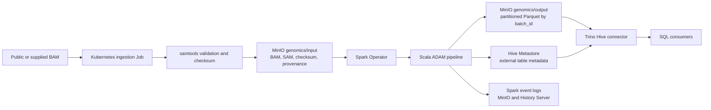

# ADAM genomic alignment pipeline

This job ingests public or user-supplied human alignment data, converts it with
ADAM 1.0.1 on Spark 3.5.6, and publishes queryable Parquet through the shared
Hive metastore.

## Architecture



In one Spark application the pipeline:

1. Converts SAM/BAM/CRAM input to ADAM records.
2. Rejects empty output.
3. Appends the batch to Parquet in MinIO.
4. Registers the external Hive table on its first run.
5. Verifies that the published partition contains exactly the batch row count.

`--batch-id` is the idempotency key. Reusing it with the same input is a no-op;
reusing it with a different row count fails validation. Use a unique, stable ID
for every source batch.

Build the pinned ingestion image and download a 100 kbp region from the public
GIAB HG002 chromosome 20 BAM into MinIO. The ingestion job also exports SAM
from the validated BAM because ADAM 1.0.1's BAM reader does not support S3A's
NIO filesystem provider:

```sh
docker build -t adam:1.0.1-idempotent jobs/adam
docker build -f jobs/adam/ingest.Dockerfile -t adam-ingest:1.0 jobs/adam
minikube image load adam:1.0.1-idempotent
minikube image load adam-ingest:1.0
kubectl apply -f jobs/adam/human-data-download.yaml
kubectl wait --for=condition=complete job/hg002-region-download -n spark --timeout=10m
kubectl apply -f jobs/adam/sparkapplication.yaml
kubectl get sparkapplication adam-pipeline -n spark -w
```

The application is complete only when both the Parquet output and Hive table
are valid. Query the result through Trino:

```sh
kubectl exec -n data deploy/trino -- trino --execute \
  'SELECT batch_id, count(*) FROM hive.genomics.hg002_alignments GROUP BY batch_id'
```

Dropping the external table does not delete the ADAM Parquet files in MinIO.
