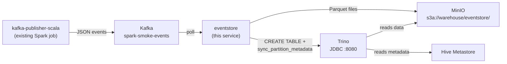

# eventstore — Kafka → Parquet/Hive consumer service

A long-running Kotlin microservice deployed as a K8s Deployment in the `data` namespace.
It consumes JSON events from a configured Kafka topic, writes Parquet files to MinIO, and registers them in a Hive table under the `eventstore` database — queryable via Trino as `eventstore.<topic_name>`.

**One deployment per topic.** To ingest a second topic, deploy another instance with a different `KAFKA_TOPIC` env var. Each topic auto-creates its own Hive table.

## Naming Convention

| Concept | Example |
|---|---|
| Service / Docker image | `eventstore:local` |
| Hive database | `eventstore` |
| Kafka topic | `spark-smoke-events` |
| Hive table | `eventstore.spark_smoke_events` (dashes → underscores) |
| S3 path | `s3a://warehouse/eventstore/spark_smoke_events/event_date=2026-07-04/` |
| Trino query | `SELECT * FROM eventstore.spark_smoke_events` |
| Consumer group | `eventstore.spark_smoke_events` (scoped per topic) |

Adding a future topic `user-signups` would produce `eventstore.user_signups` with zero code changes — just a new K8s Deployment manifest pointing at the new topic.

## Project Location

The service lives under `services/eventstore/`, **not** under `jobs/`. The `jobs/` directory is reserved for batch Spark jobs that run via SparkApplication + Spark Operator. The eventstore is a long-running microservice (K8s Deployment), similar to MinIO, Trino, and Hive.

## Data Flow



## User Review Required

> [!IMPORTANT]
> **Hive registration strategy**: The service uses **Trino JDBC** (`jdbc:trino://trino:8080/hive/default`) to create the `eventstore` database, the per-topic table, and call `system.sync_partition_metadata(...)`. This reuses the existing Trino deployment (already connected to Hive Metastore and MinIO) with zero extra dependencies. The alternative — direct HiveServer2 JDBC — would require the Hive JDBC driver (large, version-sensitive). Let me know if you prefer that.

> [!IMPORTANT]
> **Build tool**: This is the first Kotlin/Gradle project in the repo. Existing jobs use SBT/Scala. The Docker build uses the official Gradle image, so no local Gradle install is needed for `make prepare-eventstore`.

## Open Questions

1. **Buffering threshold**: The service buffers records in memory and flushes a Parquet file every **1000 records or 60 seconds**, whichever comes first. Adjust?
2. **Schema flexibility**: The initial implementation uses a fixed schema matching the `kafka-publisher-scala` JSON structure (`event_id`, `event_type`, `source`, `message`, `created_at`). Should we plan for a schema-registry or generic JSON-to-Parquet approach in the future?

---

## Design Decisions

### Kafka Consumer

| Aspect | Decision |
|---|---|
| Client | `org.apache.kafka:kafka-clients` (plain Java/Kotlin consumer, no Spark dependency) |
| Deserialisation | String key + String value, then JSON → data class via `kotlinx.serialization` |
| Consumer group | `eventstore.<table_name>` (e.g. `eventstore.spark_smoke_events`) — unique per topic so multiple eventstore deployments don't interfere |
| Offset commit | **Manual commit after Parquet flush**. Records are buffered, a Parquet file is written and closed, then offsets are committed. This gives at-least-once delivery: a crash before commit may replay records into a second UUID-named Parquet file. File name collisions are avoided, but downstream queries may need to dedupe by `event_id`. |
| Poll loop | Single-threaded. `poll(Duration.ofSeconds(1))`, runs in a `while(!shutdown)` loop with a `ShutdownHook` that calls `consumer.wakeup()` for graceful drain |

### Table Name Derivation

The Hive table name is derived from the Kafka topic name by lowercasing it, replacing non-identifier characters with underscores, collapsing repeated underscores, and prefixing `topic_` when the result would not start with a letter:

```
spark-smoke-events  →  spark_smoke_events
user-signups        →  user_signups
order.events        →  order_events  (dots also replaced)
123-events          →  topic_123_events
```

This runs once at startup and is used for the table name, S3 path, and consumer group.

### Parquet Writing

| Aspect | Decision |
|---|---|
| Library | `org.apache.parquet:parquet-avro` + `org.apache.hadoop:hadoop-aws` — writes directly to S3A via Hadoop `FileSystem` API |
| Schema | Avro schema matching the JSON event fields (see below) |
| Partitioning | By `event_date` (derived from `created_at` field, truncated to `yyyy-MM-dd`) |
| File path | Write to `s3a://warehouse/eventstore/_tmp/...` first, then move completed files to `s3a://warehouse/eventstore/spark_smoke_events/event_date=2026-07-04/events_<uuid>.parquet` |
| Flush trigger | **1000 records** or **60 seconds** since last flush, whichever first |
| Hadoop config | Configured in-code via `Configuration()`: S3A endpoint, path-style access, credentials from env vars — same pattern as the existing Spark jobs |

### Hive Table DDL (via Trino)

On startup, the service runs:

```sql
CREATE SCHEMA IF NOT EXISTS eventstore
WITH (location = 's3a://warehouse/eventstore/');
```

Then for the configured topic (e.g. `spark-smoke-events` → `spark_smoke_events`):

```sql
CREATE TABLE IF NOT EXISTS eventstore.spark_smoke_events (
    event_id    VARCHAR,
    event_type  VARCHAR,
    source      VARCHAR,
    message     VARCHAR,
    created_at  VARCHAR,
    stored_at   VARCHAR,
    event_date  VARCHAR
)
WITH (
    format            = 'PARQUET',
    partitioned_by    = ARRAY['event_date'],
    external_location = 's3a://warehouse/eventstore/spark_smoke_events/'
)
```

After each Parquet flush:

```sql
CALL system.sync_partition_metadata('eventstore', 'spark_smoke_events', 'ADD')
```

### Error Handling & Resilience

| Scenario | Behaviour |
|---|---|
| Malformed JSON | Log warning with offset details, skip record, continue. If a poll contains only malformed records, commit the skipped offsets so they do not replay forever. |
| S3/MinIO unreachable | Retry staged writes 3 times with exponential backoff (1s → 2s → 4s). If still failing, crash the pod — K8s will restart it and the consumer resumes from the last committed offset. |
| Trino unreachable at startup | Retry table creation 5 times with 5s backoff. Crash if Trino is still down (pod restart will retry). |
| Trino unreachable after flush | Retry partition sync 3 times. If still failing, crash before committing Kafka offsets. Startup also runs partition sync before polling. |
| Pod restart | Consumer rejoins group from last committed offset. Duplicate records may appear in a new Parquet file (at-least-once); downstream queries should dedupe by `event_id` when exact-once results matter. |

### Graceful Shutdown

JVM shutdown hook calls `consumer.wakeup()` → poll loop catches `WakeupException` → flushes any buffered records → commits final offsets → closes consumer and Parquet writer.

K8s `terminationGracePeriodSeconds: 90` gives the service time to drain. Kafka, Trino, and S3A calls also use bounded timeout settings.

---

## Proposed Changes

### eventstore service — `services/eventstore/`

#### [NEW] [build.gradle.kts](file:///Volumes/Projects/wexler-data-platform/services/eventstore/build.gradle.kts)

Kotlin JVM project with Shadow JAR plugin. Dependencies:

| Dependency | Version | Purpose |
|---|---|---|
| `org.apache.kafka:kafka-clients` | 3.9.0 | Kafka consumer |
| `org.jetbrains.kotlinx:kotlinx-serialization-json` | 1.6.3 | JSON parsing |
| `org.apache.parquet:parquet-avro` | 1.14.4 | Parquet writing |
| `org.apache.hadoop:hadoop-common` | 3.3.6 | Hadoop FileSystem abstraction |
| `org.apache.hadoop:hadoop-aws` | 3.3.6 | S3A filesystem implementation |
| `com.amazonaws:aws-java-sdk-bundle` | 1.12.367 | AWS SDK for S3A |
| `io.trino:trino-jdbc` | 476 | Trino JDBC driver (matches deployed Trino version) |
| `org.apache.avro:avro` | 1.12.0 | Avro GenericRecord for Parquet |
| `ch.qos.logback:logback-classic` | 1.4.14 | Logging |

#### [NEW] [settings.gradle.kts](file:///Volumes/Projects/wexler-data-platform/services/eventstore/settings.gradle.kts)

```kotlin
rootProject.name = "eventstore"
```

#### [NEW] [gradle/wrapper/](file:///Volumes/Projects/wexler-data-platform/services/eventstore/gradle/wrapper/)

Gradle wrapper scripts and wrapper properties. The Docker build currently uses the Gradle builder image directly.

#### [NEW] [Config.kt](file:///Volumes/Projects/wexler-data-platform/services/eventstore/src/main/kotlin/com/example/eventstore/Config.kt)

Data class loading all configuration from environment variables:

| Env var | Default | Purpose |
|---|---|---|
| `KAFKA_BOOTSTRAP_SERVERS` | `wexler-kafka-kafka-bootstrap.data.svc.cluster.local:9092` | Kafka broker |
| `KAFKA_TOPIC` | `spark-smoke-events` | Topic to consume |
| `S3_ENDPOINT` | `http://minio.data.svc.cluster.local:9000` | MinIO endpoint |
| `S3_BASE_PATH` | `s3a://warehouse/eventstore` | Base path — table name is appended |
| `AWS_ACCESS_KEY_ID` | *(from secret)* | S3/MinIO credentials |
| `AWS_SECRET_ACCESS_KEY` | *(from secret)* | S3/MinIO credentials |
| `TRINO_JDBC_URL` | `jdbc:trino://trino.data.svc.cluster.local:8080/hive/default` | Trino connection used to bootstrap/create the `eventstore` schema |
| `FLUSH_RECORD_THRESHOLD` | `1000` | Records per Parquet file |
| `FLUSH_INTERVAL_SECONDS` | `60` | Max seconds between flushes |
| `TABLE_NAME` | derived from topic | Optional explicit Hive table/S3 path name to avoid topic-normalization collisions |
| `CONSUMER_GROUP` | `eventstore.<TABLE_NAME>` | Optional explicit Kafka consumer group |

Derived at startup (not configurable):
- `tableName` = Hive-safe topic name (`spark-smoke-events` -> `spark_smoke_events`)
- `consumerGroup` = explicit `CONSUMER_GROUP`, or `eventstore.<tableName>`
- `s3OutputPath` = `<S3_BASE_PATH>/<tableName>`

#### [NEW] [EventRecord.kt](file:///Volumes/Projects/wexler-data-platform/services/eventstore/src/main/kotlin/com/example/eventstore/EventRecord.kt)

`@Serializable` data class matching the JSON structure produced by [KafkaPublisher.scala](file:///Volumes/Projects/wexler-data-platform/jobs/kafka-publisher-scala/src/main/scala/com/example/KafkaPublisher.scala).

#### [NEW] [ParquetS3Writer.kt](file:///Volumes/Projects/wexler-data-platform/services/eventstore/src/main/kotlin/com/example/eventstore/ParquetS3Writer.kt)

Manages buffered Parquet writing to S3A. Groups records by `event_date`, writes one Parquet file per partition per flush with UUID filenames.

#### [NEW] [HiveSync.kt](file:///Volumes/Projects/wexler-data-platform/services/eventstore/src/main/kotlin/com/example/eventstore/HiveSync.kt)

Trino JDBC schema/table creation + partition sync. Partition sync failures after a flush are fatal so offsets are not committed while newly written data is invisible.

#### [NEW] [EventConsumer.kt](file:///Volumes/Projects/wexler-data-platform/services/eventstore/src/main/kotlin/com/example/eventstore/EventConsumer.kt)

Kafka poll loop with manual offset commit, buffered flush, graceful shutdown.

#### [NEW] [Main.kt](file:///Volumes/Projects/wexler-data-platform/services/eventstore/src/main/kotlin/com/example/eventstore/Main.kt)

Application entrypoint.

#### [NEW] [logback.xml](file:///Volumes/Projects/wexler-data-platform/services/eventstore/src/main/resources/logback.xml)

Console appender. Hadoop/AWS/Parquet loggers set to WARN.

#### [NEW] [Dockerfile](file:///Volumes/Projects/wexler-data-platform/services/eventstore/Dockerfile)

Multi-stage: `gradle:8.5-jdk17` builder -> `eclipse-temurin:17-jre` runtime. The non-Alpine Temurin image supports the repo's default `linux/arm64` Docker platform.

---

### K8s Deployment — `k8s/platform/`

#### [NEW] [eventstore.yaml](file:///Volumes/Projects/wexler-data-platform/k8s/platform/eventstore.yaml)

K8s Deployment in `data` namespace. Single replica. Credentials from `minio-root` secret. Uses readiness/liveness exec probes backed by `/tmp/eventstore.ready` and `/tmp/eventstore.alive`.

To deploy for a second topic, copy the manifest and change `metadata.name` and `KAFKA_TOPIC`.

---

### Build Integration

#### [MODIFY] [Makefile](file:///Volumes/Projects/wexler-data-platform/Makefile)

```makefile
build-eventstore:
	docker build --platform $(DOCKER_PLATFORM) -t $(EVENTSTORE_IMAGE) ./services/eventstore

load-eventstore:
	minikube image load $(EVENTSTORE_IMAGE)

prepare-eventstore: build-eventstore load-eventstore
```

---

## File Tree Summary

```
services/eventstore/
├── build.gradle.kts
├── settings.gradle.kts
├── Dockerfile
├── gradle/wrapper/
│   └── gradle-wrapper.properties
├── gradlew
├── gradlew.bat
└── src/main/
    ├── kotlin/com/example/eventstore/
    │   ├── Main.kt
    │   ├── Config.kt
    │   ├── EventRecord.kt
    │   ├── EventConsumer.kt
    │   ├── ParquetS3Writer.kt
    │   └── HiveSync.kt
    └── resources/
        └── logback.xml

k8s/platform/
└── eventstore.yaml          [NEW]

Makefile                      [MODIFIED]
```

---

## Verification Plan

### Build & Deploy

```bash
make prepare-eventstore
kubectl apply -f k8s/platform/eventstore.yaml
kubectl get pods -n data -l app=eventstore --watch
kubectl logs -n data -l app=eventstore -f
```

Logs should show:
1. `Schema 'eventstore' ensured`
2. `Table 'eventstore.spark_smoke_events' ensured`
3. `Subscribed to topic spark-smoke-events (group: eventstore.spark_smoke_events)`
4. `Polling for events...`

### Publish Test Events

Use the existing Kafka publisher:

```bash
make prepare-job JOB=kafka-publisher-scala
kubectl apply -f jobs/kafka-publisher-scala/sparkapplication.yaml
kubectl logs -n spark kafka-publisher-scala-driver -f
```

The publisher defaults to 25 events, so either wait up to 60 seconds for the interval flush or temporarily set `FLUSH_INTERVAL_SECONDS=5` on the eventstore Deployment during verification.

### Verify Parquet in MinIO

Open `http://minio.wexler.test`, browse to `warehouse/eventstore/spark_smoke_events/`. Expect:

```
eventstore/
  spark_smoke_events/
    event_date=2026-07-04/
      events_<uuid>.parquet
```

### Verify Hive/Trino Query

Via DataGrip (`jdbc:trino://localhost:18089/hive/eventstore`) or Trino UI:

```sql
SELECT * FROM eventstore.spark_smoke_events ORDER BY created_at;
SELECT event_date, count(*) FROM eventstore.spark_smoke_events GROUP BY event_date;
```

### Verify Consumer Offset

In Kafbat UI (`http://kafka-ui.wexler.test`), check consumer group `eventstore.spark_smoke_events` — lag should be 0 after the flush.
